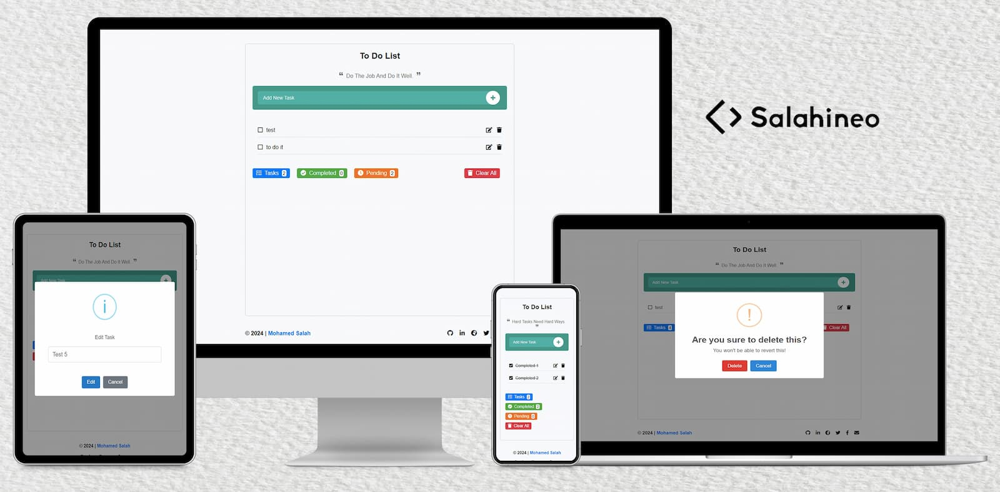

<h2 align="center">Enhanced To-Do</h2>

<p align="center">
  
</p>

### 🎯 Goal

Enhanced To-Do is a well-organized task management tool focused on productivity. This project aims to streamline task management for better efficiency in daily life and work.

---

### 🌐 Demo

Check out the live demo [here](https://todo.portfolio.salahineo.com/).

---

### 💻 Stack

- HTML
- CSS
- JavaScript
- jQuery

> The project is fully responsive, ensuring it works across all devices.

---

### 🏗️ Installation

- Fork the repository by clicking the `Fork` button at the top-right of the repository page.
- Clone your forked repository locally
```bash
git clone https://github.com/your-username/repo-name.git
```
- Navigate to the project directory
```bash
cd repo-name
```
- Install NPM server globally
```bash
npm install -g serve
```
- Start the server
```bash
serve
```
- Open your browser and navigate to `http://localhost:<port>` to view the project.

> Replace `<port>` with the port number displayed in the terminal.

---

### ⚓ Contributing

Contributions are welcome and greatly appreciated! If you'd like to contribute to this project, please follow these steps:

- Fork the repository by clicking the `Fork` button at the top-right of the repository page.
- Clone your forked repository locally
```bash
git clone https://github.com/your-username/repo-name.git
```
- Create a new branch for your contribution
```bash
git checkout -b feature/your-feature-name
```
- Make your changes and ensure your code is clean and properly formatted.
- Commit your changes
```bash
git commit -m "feat: your feature description"
```
- Push your branch to your forked repository
```bash
git push origin feature/your-feature-name
```
- Submit a Pull Request (PR) by going to the original repository and clicking the "New Pull Request" button.

---

### 📋 Contribution Guidelines

- Ensure your changes are well-tested and documented.
- Adhere to the existing code style and project structure.
- Provide clear descriptions in your PR regarding the changes and enhancements.
- Be open to feedback and discussion in the PR review process.

---

### ✉️ Contact

[](https://linktree.salahineo.com)

---

### 🔓 License

[](https://www.gnu.org/licenses/gpl-3.0)

---

**If you find my work good, consider giving it a ⭐ or fork-ing to show some ❤️. It helps me stay on track and be motivated.**
